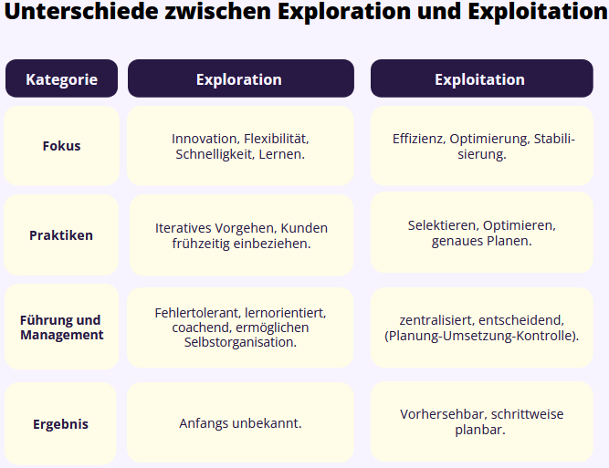
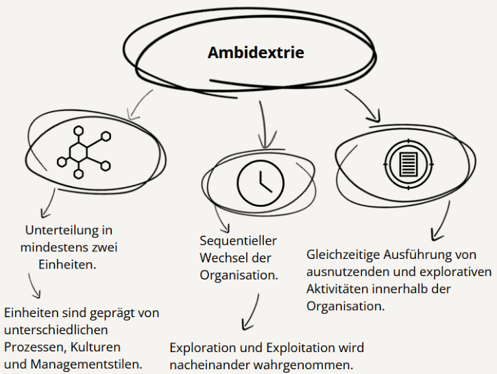
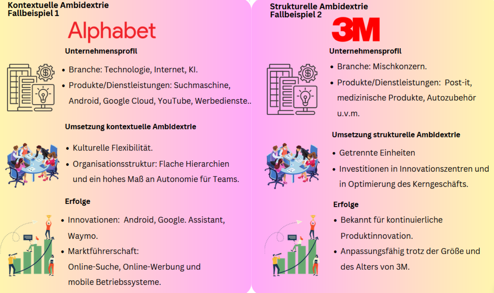

## Ambidextrous Organizations

### 

---

### Agenda

1. Einführung
2. Organisationale Ambidextrie
3. Fallbeispiele
4. Implementierung von Ambidextrie
5. Herausforderungen
6. Schlussfolgerung

---

### 1. Einführung

### Definition

_Ambidextrous Organizations_ sind Unternehmen, die die Fähigkeit besitzen, sowohl effizient im aktuellen Geschäft zu operieren, als auch gleichzeitig innovativ zu sein, um neue Wachstumschancen zu entwickeln.

- Ambidextrous = Beidhändigkeit.
- Verweist auf _Exploitation_ (Ausnutzung von Bestehendem) als auch _Exploration_ (Erkundung von Neuem).

---

### 1.1. Exploration vs. Exploitation

### 

---

### 2. Organisationale Ambidextrie

Unternehmen, die Ambidextrie ausüben...

- sind anpassungsfähig.
- fördern Innovation und nutzen Kernkompetenzen.
- können Disruption vermeiden.
- fördern Kreativität.
- nehmen eine kurz- und langfristige Perspektive ein.

&rarr; Für sie ist Ambidextrie ein Schlüsselkonzept, wenn sie in einem komplexen und dynamischen Geschäftsumfeld erfolgreich sein möchten.

---

### 2.1. Gestaltungsvarianten der Ambidextrie

### 

---

### 3. Fallbeispiele

---

### 

---

### 4. Implementierung von Ambidextrie

- **Verständnis und Commitment des Managements.**

- **Ziele definieren**

- **Auswahl des Modells.**

- **Ressourcenallokation.**

- **Kontinuierliche Bewertung und Verbesserung.**

---

### 5. Herausforderungen und Kritik

- **Schwierigkeiten bei der Implementierung:** Kommunikations- und Koordinationsherausforderungen.

- **Risiken der Dualität:** Ressourcenkonflikte, Innovationsrisiken.

- **Langfristiger Erfolg ist nicht garantiert:** Unvorhersehbare externe Faktoren, interne Probleme.

---

### 6. Schlussfolgerung

- Ambidextrie gewinnt an Bedeutung: Forschung nimmt zu.

- Zunehmendes Interesse an hybriden Modellen.

- Erfolg hängt stark von der Unternehmenskultur und der Einstellung der Mitarbeiter ab.

- Schlüsselthema in disruptionsanfälligen Branchen.

---

### VIELEN DANK FÜR IHRE AUFMERKSAMKEIT

Bei weiteren Fragen:

